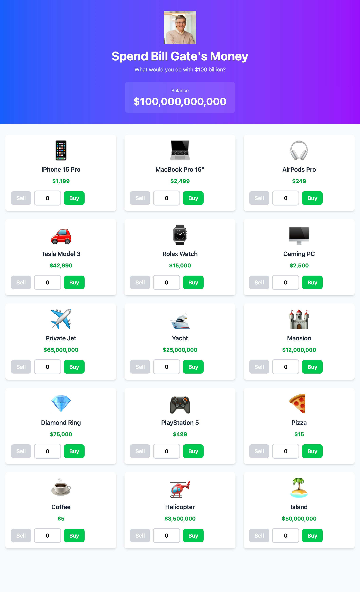

# 💰 Spend Bill Gates' Money

A fun interactive web app where you can spend Bill Gates' fortune! Buy luxury items, supercars, yachts, and more while watching your balance decrease in real-time.

## 🚀 Features

- 💵 Start with $100 billion
- 🛒 Buy and sell various luxury items
- 📊 Real-time balance tracking
- 🧾 Receipt summary of purchases
- 📱 Fully responsive design

## 🛠️ Tech Stack

- **React** with TypeScript
- **Vite** for fast development
- **Tailwind CSS** for styling
- **useReducer** for state management

## 📦 Installation

```bash
# Clone the repository
git clone <your-repo-url>

# Install dependencies
npm install

# Run development server
npm run dev
```

## 🎮 How to Play

1. Browse through luxury items
2. Click **Buy** to purchase (+1 quantity)
3. Click **Sell** to return items (-1 quantity)
4. Type a number in the input to buy multiple items at once
5. Watch your balance and receipt update in real-time!

## 📸 Screenshot



## 🎓 Learning Project

Built as a learning project to practice:

- React hooks (useReducer, useState, useEffect)
- TypeScript interfaces and type safety
- Immutable state updates
- Component composition
- Tailwind CSS utility classes

---

Made with ❤️ and TypeScript

```

---


```
